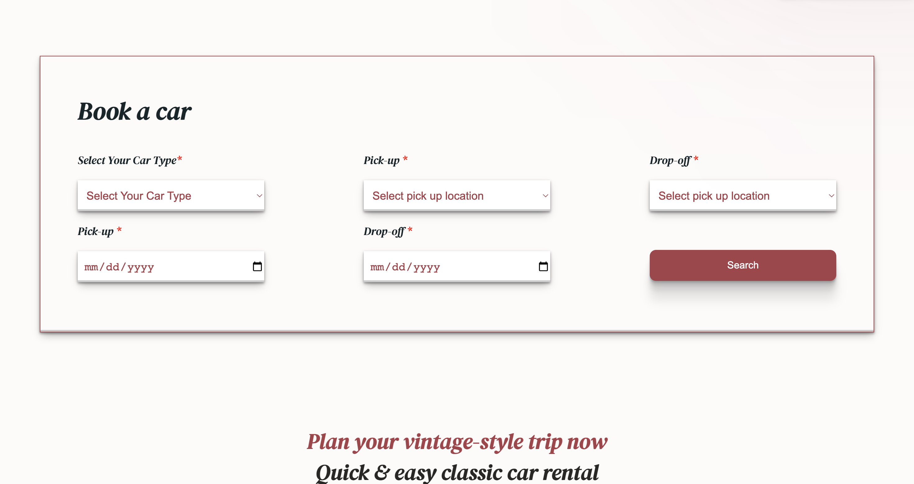

## Welcome!👋

# Vintage Car Rental Company

*Caption: The homepage showcasing vintage car models.*

*Caption: The booking page with a reservation form.*

*Caption: Email confirmation screen after successful reservation.*

and pages you can see in the live demo

This is a web application for a vintage car rental company, featuring a unique and personalized design.The entire visual layout and styling have been carefully crafted to reflect the nostalgic charm of vintage cars.Every aspect of the design, including color schemes, typography, and user interface elements, has been thoughtfully chosen to provide an immersive and enjoyable experience for users. Users can browse car models, book rides, and explore different pages such as About, Team, Models, and Contact. The application is built using HTML, CSS, JavaScript, React.js, and TypeScript.

# Demo

  To visit the live demo of the web application , click [here](https://vintage-car-rental.netlify.app/)

## Features

- Car model browsing
- Ride booking functionality
- Reservation document generation
- Email confirmation for reservations
- Responsive design for mobile and desktop devices

# Prerequisites

Before running the application, ensure you have the following installed:

- Node.js
- npm (Node Package Manager)

# Getting Started

Follow these steps to get the application running on your local machine:

1. Clone the repository: git clone <repository-url>
2. Navigate to the project directory: cd vintage-car-rental
3. Install the dependencies: npm install
4. Start the development server: npm start
5. Open your web browser and visit: http://localhost:3000

# Usage

1. Browse the car models by visiting the "Models" page.
2. To book a ride, select a car and click on the "Book Now"  button.
3. Fill in all the required fields in the reservation document.
4. Click the "Reserve Now" button to submit the reservation.
5. Open your browser and visit the following pages:

- Team: Navigate to https://vintage-car-rental.netlify.app/Team meet our exceptional team members.

- About: Explore https://vintage-car-rental.netlify.app/About to learn the inspiring story behind our company. Gain insights into our passion for vintage cars, our commitment to exceptional customer experiences, and our dedication to preserving automotive history.

- Contact: Connect with us through https://vintage-car-rental.netlify.app/ContactField. Fill out the contact form to send us a message or use the provided email address and phone number to reach out directly. We're here to assist you with any inquiries or feedback.

- Models: Unveil our exquisite collection of vintage car models by visiting https://vintage-car-rental.netlify.app/Models Immerse yourself in the beauty, craftsmanship, and nostalgia of these iconic automobiles.

- Review: Explore feedback and testimonials from other customers on the "Review" page. Visit  https://vintage-car-rental.netlify.app/Review to read about their experiences with our vintage car rental company.

# Technologies Used

- HTML
- CSS
- JavaScript
- React.js
- TypeScript

# Contact

For any inquiries or support, please contact: 

- Mariam Gogaladze 
- gogaladzemariam8@gmail.com
